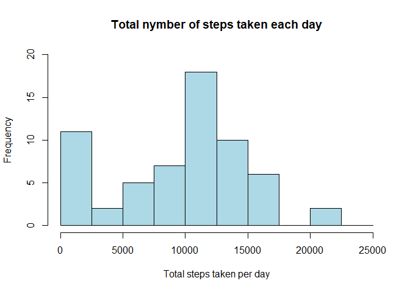
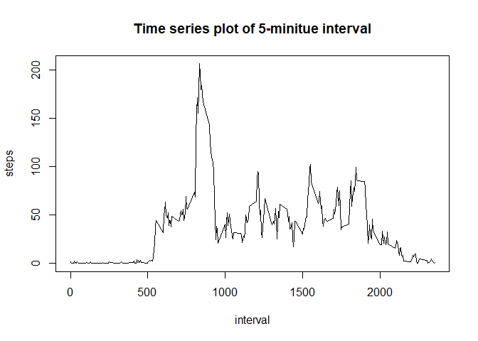
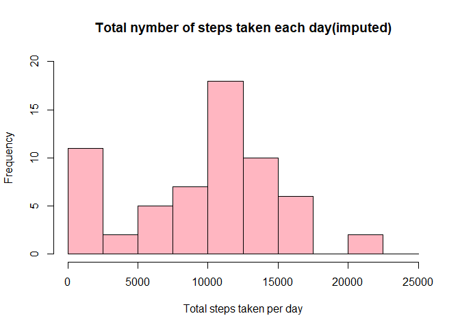
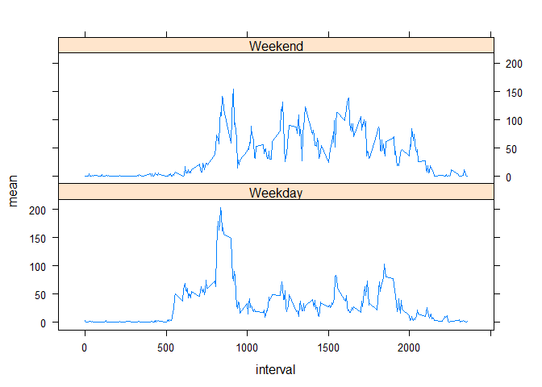

## 1.Loading and Processing the data


```r
library(ggplot2)

activity <- read.csv("./data/activity.csv")

activity$date <- as.Date(as.character(activity$date, "format = %Y-%m-%d"))
summary(activity)
```

```
##      steps             date               interval     
##  Min.   :  0.00   Min.   :2012-10-01   Min.   :   0.0  
##  1st Qu.:  0.00   1st Qu.:2012-10-16   1st Qu.: 588.8  
##  Median :  0.00   Median :2012-10-31   Median :1177.5  
##  Mean   : 37.38   Mean   :2012-10-31   Mean   :1177.5  
##  3rd Qu.: 12.00   3rd Qu.:2012-11-15   3rd Qu.:1766.2  
##  Max.   :806.00   Max.   :2012-11-30   Max.   :2355.0  
##  NA's   :2304
```

## 2. What is mean total number of steps taken per day?
### 2-1. Calculate the total number of steps taken per day.

```r
Total_step_byDay <- with(activity, aggregate(steps, by = list(date), FUN = sum, na.rm =TRUE))
names(Total_step_byDay) <- c("date", "steps")
print(Total_step_byDay)
```

```
##          date steps
## 1  2012-10-01     0
## 2  2012-10-02   126
## 3  2012-10-03 11352
## 4  2012-10-04 12116
## 5  2012-10-05 13294
## 6  2012-10-06 15420
## 7  2012-10-07 11015
## 8  2012-10-08     0
## 9  2012-10-09 12811
## 10 2012-10-10  9900
## 11 2012-10-11 10304
## 12 2012-10-12 17382
## 13 2012-10-13 12426
## 14 2012-10-14 15098
## 15 2012-10-15 10139
## 16 2012-10-16 15084
## 17 2012-10-17 13452
## 18 2012-10-18 10056
## 19 2012-10-19 11829
## 20 2012-10-20 10395
## 21 2012-10-21  8821
## 22 2012-10-22 13460
## 23 2012-10-23  8918
## 24 2012-10-24  8355
## 25 2012-10-25  2492
## 26 2012-10-26  6778
## 27 2012-10-27 10119
## 28 2012-10-28 11458
## 29 2012-10-29  5018
## 30 2012-10-30  9819
## 31 2012-10-31 15414
## 32 2012-11-01     0
## 33 2012-11-02 10600
## 34 2012-11-03 10571
## 35 2012-11-04     0
## 36 2012-11-05 10439
## 37 2012-11-06  8334
## 38 2012-11-07 12883
## 39 2012-11-08  3219
## 40 2012-11-09     0
## 41 2012-11-10     0
## 42 2012-11-11 12608
## 43 2012-11-12 10765
## 44 2012-11-13  7336
## 45 2012-11-14     0
## 46 2012-11-15    41
## 47 2012-11-16  5441
## 48 2012-11-17 14339
## 49 2012-11-18 15110
## 50 2012-11-19  8841
## 51 2012-11-20  4472
## 52 2012-11-21 12787
## 53 2012-11-22 20427
## 54 2012-11-23 21194
## 55 2012-11-24 14478
## 56 2012-11-25 11834
## 57 2012-11-26 11162
## 58 2012-11-27 13646
## 59 2012-11-28 10183
## 60 2012-11-29  7047
## 61 2012-11-30     0
```
### 2-2. Make histogram of the total number of steps taken each day.

```r
hist(Total_step_byDay$steps, ylim = c(0,20), breaks = seq(0,25000, by = 2500), main = "Total nymber of steps taken each day", xlab = "Total steps taken per day", col = "lightblue")
```

<!-- -->
### 2-3. Calcurate and report the mean and median of steps taken per day.

```r
mean(Total_step_byDay$steps)
```

```
## [1] 9354.23
```

```r
median(Total_step_byDay$steps)
```

```
## [1] 10395
```

## What is average daily activity pattern?
### 3-1. Make time series plot of the 5-minitue interval and the average number of step taken.

```r
plot(aggregate(steps ~ interval, data = activity, FUN = mean), type = "l", main = "Time series plot of 5-minitue interval")
```

<!-- -->

### 3-2. Which 5-minitute interval contains the maximum number of steps?
The answer is:

```r
max(activity$steps, na.rm = TRUE)
```

```
## [1] 806
```


## Imputinig missing value
## 4-1. Calculate and report the total number of missing values in the dataset.

```r
sum(is.na(activity))
```

```
## [1] 2304
```


## 4-2. Decise a strategy for filling in missing values.
I will use the mean of 5-minitue interval for replacing NAs.


## 4-3. Create a new dataset that is equal to the original dataset but with the missing data filled in.


```r
imputed_steps <- mean(Total_step_byDay$steps)/(5*12*24)
activity_imputed <- transform(activity, steps = ifelse(is.na(activity$steps), yes = imputed_steps, no = activity$steps))
total_step_byDay_imputed <- aggregate(steps~date, activity_imputed, sum)
```

### 4-4-a. Make histogram of the total number of steps. 

```r
hist(total_step_byDay_imputed$steps, ylim = c(0,20), breaks = seq(0,25000, by = 2500), main = "Total nymber of steps taken each day(imputed)", xlab = "Total steps taken per day", col = "lightpink")
```

<!-- -->


### 4-4-b. Calculate and report the mean and median total number of steps taken per day.

```r
mean(total_step_byDay_imputed$steps)
```

```
## [1] 9599.586
```

```r
median(total_step_byDay_imputed$steps)
```

```
## [1] 10395
```

### 4-4-c. What is the impact of imputing missing data on the estimates of the total daily number of steps?
Since I used the mean as imputed data, it is same median between first data and imputed data.
On the other hand, there were so many NAs in first data, and also mean of first data was smaller than median, so that makes imputed data's mean will smaller than first data's one.


## Are there difference in activity patterns between weekdays and weekends?
### 5-1.Create a new factor variable in the dataset with two levels ??? ÅgweekdayÅh and ÅgweekendÅh indicating whether a given date is a weekday or weekend day.

```r
library(dplyr)
```

```
## 
## Attaching package: 'dplyr'
```

```
## The following objects are masked from 'package:stats':
## 
##     filter, lag
```

```
## The following objects are masked from 'package:base':
## 
##     intersect, setdiff, setequal, union
```

```r
total_step_byDay_imputed$date<-as.Date(total_step_byDay_imputed$date)
total_step_byDay_imputed<-mutate(total_step_byDay_imputed,weekday=weekdays(date))
head(total_step_byDay_imputed)
```

```
##         date     steps weekday
## 1 2012-10-01  1870.846  åéójì˙
## 2 2012-10-02   126.000  âŒójì˙
## 3 2012-10-03 11352.000  êÖójì˙
## 4 2012-10-04 12116.000  ñÿójì˙
## 5 2012-10-05 13294.000  ã‡ójì˙
## 6 2012-10-06 15420.000  ìyójì˙
```

```r
total_step_byDay_imputed$weekday[!total_step_byDay_imputed$weekday=="ìyójì˙" & !total_step_byDay_imputed$weekday=="ì˙ójì˙"]<-"Weekday"
total_step_byDay_imputed$weekday[total_step_byDay_imputed$weekday=="ìyójì˙" | total_step_byDay_imputed$weekday=="ì˙ójì˙"]<-"Weekend"
```

### 5-2.Make a panel plot containing a time series plot of the 5-minute interval and the average number of steps taken, averaged across all weekday days or weekend days.

```r
library(dplyr)
activity_imputed$date<-as.Date(activity_imputed$date)
activity_imputed<-mutate(activity_imputed,weekday=weekdays(date))
head(activity_imputed)
```

```
##      steps       date interval weekday
## 1 6.495993 2012-10-01        0  åéójì˙
## 2 6.495993 2012-10-01        5  åéójì˙
## 3 6.495993 2012-10-01       10  åéójì˙
## 4 6.495993 2012-10-01       15  åéójì˙
## 5 6.495993 2012-10-01       20  åéójì˙
## 6 6.495993 2012-10-01       25  åéójì˙
```

```r
activity_imputed$weekday[!activity_imputed$weekday=="ìyójì˙" & !activity_imputed$weekday=="ì˙ójì˙"]<-"Weekday"
activity_imputed$weekday[activity_imputed$weekday=="ìyójì˙" | activity_imputed$weekday=="ì˙ójì˙"]<-"Weekend"

activity_imputedline<-group_by(activity_imputed, interval, weekday)
activity_imputedlinesummary<-summarize(activity_imputedline,mean=mean(steps))
activity_imputedlinesummary<-as.data.frame(activity_imputedlinesummary)
activity_imputedlinesummary$weekday<-as.factor(activity_imputedlinesummary$weekday)
library(lattice)
xyplot(mean ~ interval | weekday, data=activity_imputedlinesummary, layout=c(1,2), type="l")
```

<!-- -->
